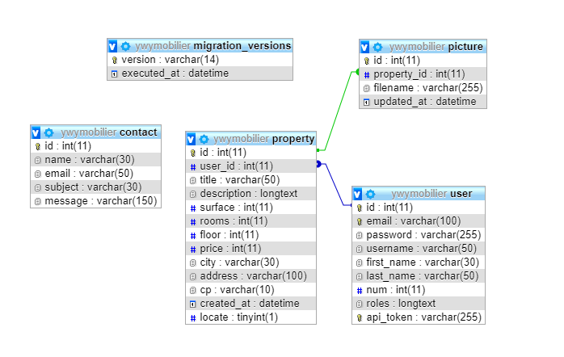

# Ywymobilier

Site web permettant aux étudiants de cherche un logement dans la région lyonnaise. Sur les offres qui les interessent sera disponible le numéro du propriétaire pour le contacter.
Les propriétaires auront accès à un back office leur permettant d'ajouter, modifier ou supprimer des biens qui seront affichés dans un onglet offres pour les étufiants.
Une application mobile sera disponible à destination DES ETUDIANTS seulement, qui pourront regarer quand ils souhaitent les nouvelles annonces plus rapidement.

# Techonologies utilisées

[Symfony 4](https://symfony.com/)  
[Twig](https://twig.symfony.com/)  
[Heroku pour le déploiement](https://dashboard.heroku.com/)  
[MySQL / JaywsDB MySQL](https://www.jawsdb.com/)  
[VichUploader pour la gestion des images](https://github.com/dustin10/VichUploaderBundle/tree/master/docs)

Langage utilisé : PHP/JS

# Fonctionnalités précises 

- Ajout/suppresion/modifiction de biens pour les propriétaires  
- Inscription connexion avec role (Etudiant ou propriéaire)  
- Contact pour laisser un message aux créateurs  
- Contact du propétaire (le numéro et le mail s'affiche mais ne permette pas de directement contacter via le site)  
- Affichage en détail des propriétés

# Pour tester le site

Allez dans la page connexion. 
Ensuite il faut vous connecter avec les identifiants (id :admin / mdp: admin) pour tester le back office,  
Essayez d'ajouter des biens en respectant quelques critère (blocage des loyers trop élevé, d'une description trop courte par exemple)  
Allez dans la page administration, et tentez de créer un bien, de le modifier et ensuite le supprimer)  
naviguer a travers les offres pour voir le rendu de votre offre.  
La gestion de vos images doit fonctionner hormis un bug toujours pas régler a l'heure actuelle, la première photo que vous ajoutez ne se supprimera pas, on essayera de régler cela le plus vite possible.  
Vous pouver vous rendre ensuite sur mon profil pour vérifier que vos informations sont bonnes puis vous déconecter si vous le souhaitez.  En revanche le système de Token fournit par symfony qui permet de fermer une session au  bout d'un certain laps de temps connait quelque problème dont on ne connait pas encore la source, nous nous en somme rendu compte un peu tard pour corriger le bug le jour du rendu.

# Auteurs du site 

[Florian BERROT](https://github.com/Flours06)  
[Steven COPY](https://github.com/theejkb)

# Lien du site en ligne

[Ywymobilier](http://ywymobilier.herokuapp.com/)

# Notre base de données (MySQL)

## User  
int id Primary Key, varchar email, varchar password, varchar username, varchar first_name, varchar last_name, int num, longtext roles, varchar api_token 

## Property  
int id Primary Key, int user_id Foreign Key in reference to id of User, varchar title, longtext description, int surface, int rooms, int floor, int price, varchar city, varchar address, varchar cp, timestamp created_at, tinyint locate  
  
## Picture  
int id Primary Key, int property_id Foreign Key in reference to id of Property, varchar filename, datetime upadted_at     

## Contact   
int id Primary Key, varchar name, varchar email, varchar subject, varchar message

